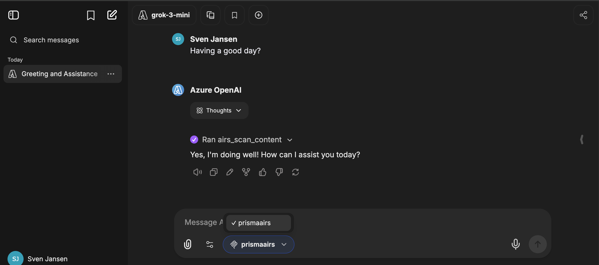

# panw-airs-lab-runtime


## 💡 Overview

This repository sets up a chatbot application with Palo Alto Networks AIRS MCP integration. It is intended to provide an easily accessible solution to try AIRS with different models and structures.
Quite some parts in here are (at least) learned from cdot65's repo https://github.com/cdot65/prisma-airs-mcp / https://cdot65.github.io/prisma-airs-mcp/. Credits to him for his awesome work! 

## 🌟 Components

* LibreChat: As chat frontend and MCP client
* Palo Alto Networks AIRS MCP: As client for the PRISMA AIRS API (https://github.com/PaloAltoNetworks/pan-mcp-relay)
* nginx: As reverse proxy for SSL connections to the web frontend
* Docker: to run everything inside nice little containers

## 💡 Specifics

The setup has been developed and evaluated using a single Ubuntu VM in the EMEA SE shared Azure tenant. Azure Foundry is used as LLM backend. Make changes according to your specific setup. 

The basic environment setup is explicitly not covered here, as your individual environment will differ. Just translate specifics to meet your parameters.

---

## 🚀 Set things up

These instructions will get you a copy of the project up and running on a ubuntu/linux machine for development and testing purposes.

### Prerequisites

This projects assumes you have the follwing in place
- Some kind of host machine (Example: Ubuntu VM on Azure)
- A domain under your control (example: jansvensen.de)
- A fqdn for your LAB to be accessed publicly (example: panw-airs-lab-runtime.jansvensen.de)
- A DNS record registered for the fqdn, pointing to the external IP of your host machine

### Prepare installation files

You'll need GIT installed to get this going. All other requirements are installed via "setup-requirements.sh"

```bash
# Install GIT
sudo apt install git -y

# Clone GIT repo
git clone https://github.com/jansvensen/panw-airs-lab-runtime.git

# Change to the repo directory
cd panw-airs-lab-runtime
```

### Set up the requrements

```bash
# Make the repo's shell scripts executable
chmod +x *.sh

# Make sure, all requirements are met
./setup-requirements.sh
```

### Configure nginx
nginx is used as reverse proxy, so you can safely access your environment with SSL. It is setup in "setup-requirements.sh", but needs a few manual steps to be fully configured.

```
(Temporarily) enable http(s) ingress traffic on your firewall. Your firewall should be filtering http(s) ingress traffic depending on your specific requirements. Certbot/LetsEncrypt requires ingress traffic on http(s) 80/443, so make sure, they can access your fqdn to set up the certificates.
```

### Request and store the certificates
```bash
# Request certificate according to your nginx default file
sudo certbot --nginx --non-interactive --agree-tos -m your@mailaddress.com -d your-host.your.domain
```

### Edit the default nginx sites config file to match your setup. Keeping it simple here.
```bash
# Edit the default file
# You'll find a prepared "default" file for nginx in the "nginx" folder (./nginx/default). Edit the file to suit your domain and server info.

# Backup the standard default file
sudo mv /etc/nginx/sites-available/default /etc/nginx/sites-available/default.bak

# Copy the new default file from the repo to the target directory
sudo cp ./nginx/default /etc/nginx/sites-available/default
```

# Make sure you're good to go
```bash
# Verify the nginx configuration
sudo nginx -t

# Restart nginx to apply the changes
sudo systemctl reload nginx
```

### Prepare your .env file
```bash
# Copy the example .env file
cp ./.env.example ./.env

# Edit the .env file with your details. Required values are
- AIRS_API_KEY=<YourAIRSAPIKey>
- AIRS_DEFAULT_PROFILE_NAME=<YourAIRSProfile>
- AZURE_API_KEY=<YourAzureAPIKey>
```

### Install docker containers
```bash
# This will pull all relevant images and create containers upon it.
sudo docker compose up -d

# Verify the outcome. 
sudo docker ps

# You should now have these 6 containers running.
 ✔ Container prisma-airs-mcp
 ✔ Container chat-mongodb
 ✔ Container chat-meilisearch
 ✔ Container vectordb
 ✔ Container rag_api
 ✔ Container LibreChat
```

## 🎯 Good to go. Sit back and enjoy the ride!
You should no be able to access your librechat gui at https://your-host.your.domain. Create an account, log in and get things going. 




## 👷 Not your type of environment? Make it so!

This repo expects you to use Azure Foundry for LLM hosting. The relevant settings can be found in
- .env: Access Key(s)
- librechat.yaml: Endpoint configuration including model selection

If your environments differs, please change settings accordingly and re-deploy the containers.
```bash
# For the lazy ones, including myself: 
sudo docker compose stop && git pull && sudo docker compose up -d && sudo docker ps
```